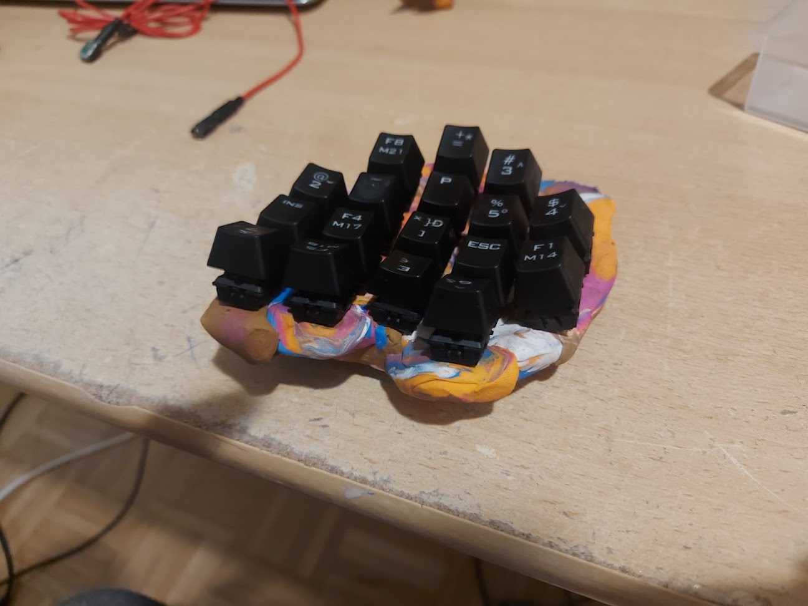
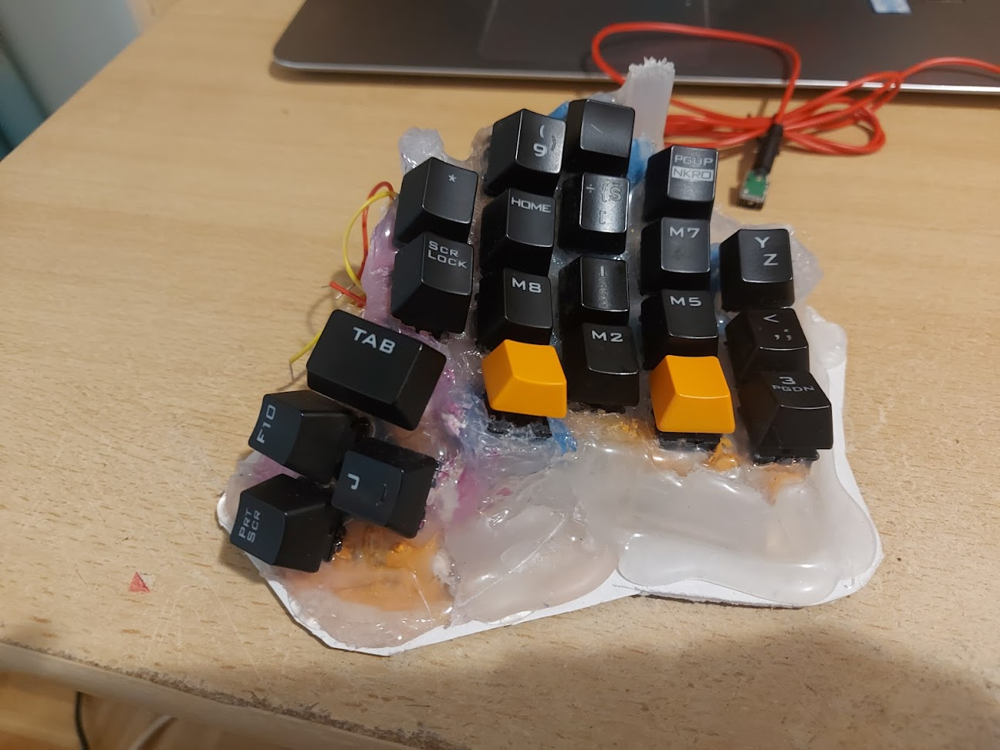
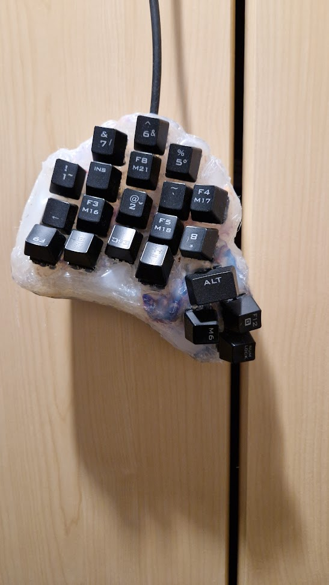
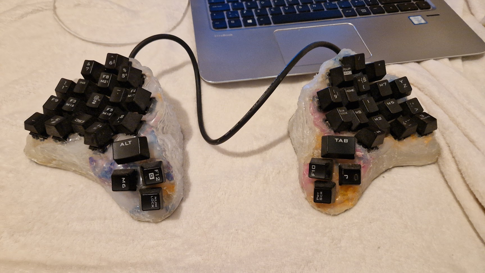
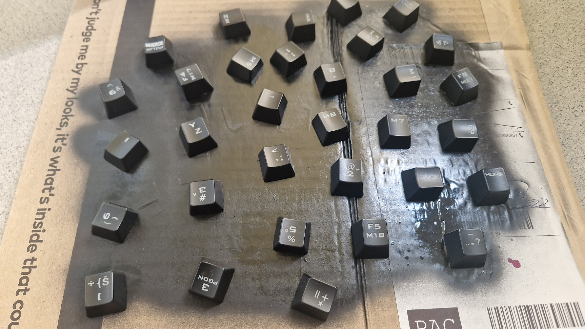
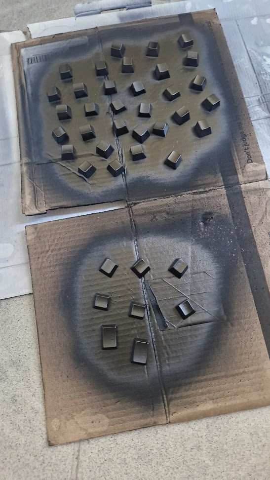
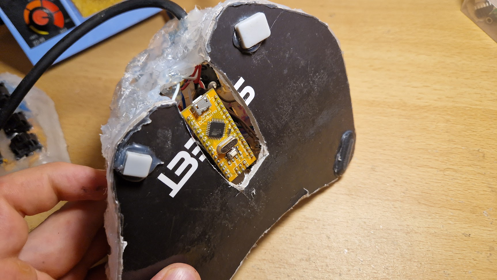
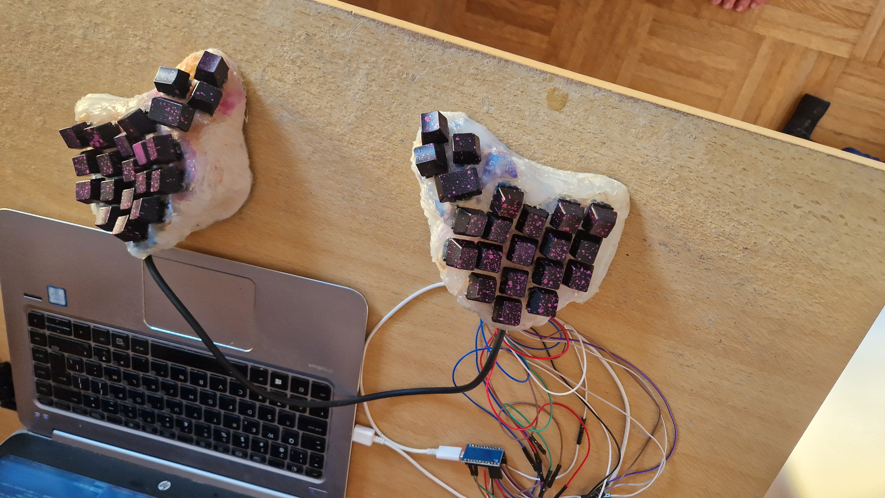

# My DIY ergonomic split keyboard
This project details the process of how I made my own keyboard and includes
most of the code that runs on it.

## How it started
This project began one lazy weekend when I watched one too many YouTube videos
of split keyboards. At the time I was looking for a new keyboard and the
concept of a split keyboard excited me. But I couldn't find anything in a
decent price range for my country. So I decided to make my own.

## Making the first version

I saw plenty of projects of people making their own keyboards so I knew it
would be possible.

I started out with a simple grid keyboard (outlined in this
[tutorial](https://www.baldengineer.com/arduino-keyboard-matrix-tutorial.html))
hooked up to an Arduino I had lying around. That's when I noticed the first
problem. My Arduino Nano didn't have the right microchip to act as a keyboard.
The chip that was missing was the ATmega32U4.

I decided I would go buy the Arduino I needed the following day and start work
on the keyboard grid.

The first thing I needed was some keyswitches. I could have ordered new ones
but naahh. I had a perfectly good mechanical keyboard with keyswitches ripe for
the taking. So with a little bit of pain, pliers and a soldering iron I was
able to remove the keyswitches I needed.

The next step was making the casing for the keycaps. At the time I didn't have
a 3D printer to print the case (like most DIY keyboards) so I used the next
best thing, play-doh. The first step was to shape the play-doh into a concave
shape for the keys to sit in. The goal was to shape it into what would be most
natural for my fingers.

Once the shape was to my liking I poured hot glue between the keys to solidify
it. Turns out play-doh really doesn't like heat. It gets more malleable the
hotter it is. So to combat this I put it in the freezer after every couple of
rows of hot glue. Eventually I got the shape I wanted.

Then came the wiring and the soldering, as outlined in this
[tutorial](https://www.baldengineer.com/arduino-keyboard-matrix-tutorial.html).

With all that done I had something that resembled a keyboard.

Now I needed to connect the two keyboards. I had a left keyboard that would be
connected to the computer and a right keyboard that would be connected to the
left. The way I decided to do this was to have 2 Arduinos that communicated
through I2C. I set the right keyboard as the master that transmits the key
pressed to the left keyboard. The way I set it up is probably not the standard
way of using I2C, and I could have used a way of communicating that didn't
require 4 cables, but it worked so I moved on.

The final step was to write the keyboard software on the Arduino that would
interface with the computer as a keyboard. But there was a problem. The local
stores didn't have the Arduino I was looking for. Which meant my keyboard could
only send Serial text to the computer and could not act as a keyboard. I
decided that for the time being I would finish this keyboard with the current
Arduino and use a Python script that listened to the Serial port of the
keyboard and called Keyboard events.

With this I had a functioning keyboard.

This version of the keyboard was made in 2 days with, in all honesty, pretty
shitty code. The Python code used is in the *./old_python_keyboards/*
directory. There are a couple of versions in there. The Arduino code for this
first version was unfortunately lost.

## The upgraded version

I used the keyboard for about 6 months. The Python script worked, even if it
was a bit annoying that I had to log in to my computer with a different
keyboard. I had a lot of fun learning to use the keyboard. When I got good
enough I actually started using it at my work. But it did not last. At the time
I worked mostly on my laptop and the keyboard was too big to carry around. So I
stopped using it.

A few years passed and in that time I had gotten the Arduino Pro Micro (a
version that contains the ATmega32U4 microchip). And on another weekend where I
watched one too many videos about split ergonomic keyboards, I decided to
upgrade my keyboard with the new Arduino.

### Fun redesign

The first thing I started with were the keycaps. I had some spray paint lying
around that I thought would be perfect for the keys. With a little bit of
experimenting I found a good way of colouring them.

So I did the same for all the keycaps.

### Replacing the Arduino

The next thing I wanted to do was replace the old Arduino with the new Pro
Micro.

Before removing it I needed to understand the layout of the key matrix. And
what was a bit harder, I needed to understand how the second Arduino was
communicating with the first, since I had lost the code I used to program them.
It was a particularly satisfying solve.

### Writing the code
Then all that was left was writing the new keyboard code. I got lucky that the
second Arduino contained all the metadata about keypresses that I needed, so I
didn't have to take it out and reprogram it as well. And that was it.

