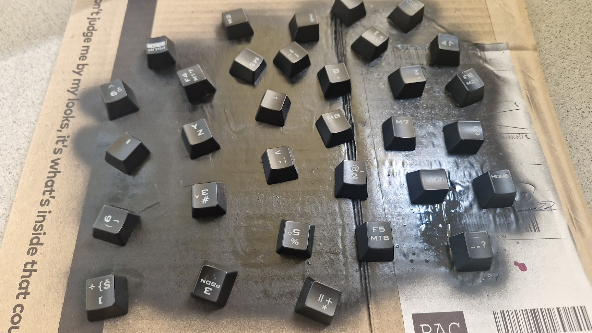

# My DIY ergonomic split keyboard
This project details the process of how i made my own keyboard and includes
most of the code that runs on it. 

## How it started 
This project begen one lazy weekend when i watched one too many youtube videos
of split keyboards. At the time i was looking for a new keyboard and the
concept of a split keyboard excited me. But I couldn't find anything in a
decent pricerage for my country. So I decided to make my own. 

## Making the first version

I saw plenty of projects of people making their own keyboards so i knew it
would be possible. 

I started out with a simple grid keyboard (outlined in this
[tutorial](https://www.baldengineer.com/arduino-keyboard-matrix-tutorial.html))
hooked up to a arduino i had laying around. Thats when i noticed the first
problem. My arduno NANO didn't have the right microchip to act as a keyboard.
The chip that was missing was the ATmega32U4. 

I decided I would go buy the arduino I needed the following day and start work
on the keyboard grid.

First thing I needed were some keyswitches. I could have ordered new ones but
naahh. I had a perfectly good mechanical keyboard with keyswitches ripe for the
taking. So with a little bit of pain, pliers and a sodering iron i was able to
remove the keyswitches i needed. 

The next step was making the casing for the keycaps. At the time I didnt have a 3d printer to print the case (like most DIY keyboards) so i used the next best thing, play-doh. The first step was to shape the play-doh into a concave shape where the keys will lay on. The goal was to shape it into what will be most natural for my fingers.

Once the shape was to my liking I pored hot glue between the keys to solidify it. Turns out play-doh really doesnt like heat. It gets very mauble to hotter it is. So to combat this i put it in the freezer after every couple of rows of hot glue. Eventualy I got the shape i wanted. 

Then came the wireing and the sodering as is outlined in this [tutorial](https://www.baldengineer.com/arduino-keyboard-matrix-tutorial.html).

With All that done i had something that resembled a keyboard.

Now i needed to connect the two keyboards. I had a left keyboard that be
connected to the computer and a right keyboard that would be connected to the
left. The way I decided to do this was to have 2 arduinos that comunicated
trough I2C. I set the right keyboard as the master that transmits the key
pressed to the left tkeyboard. The way I set it up is probably not the standard
way of using I2C, and I could have used a way of comunicating that didnt
require 4 cables, but it worked so i moved on.

The final step was to write the keyboard software on the arduino that would
interface with the computer as a keyboard. But there was a problem. The local
stores didn't have the arduino I was looking for. Which ment my keyboard could
only send Serial text to the computer and could not act as a keyboard. I
decided that for the time being I would finish this keyboard with the current
arduino and use a python script that listened to the Serial port of the
keyboard and called Keyboard events. 

With this I had a functioning keyboard. 

This version of the keyboard was made in 2 days with, in all honesty, pretty
shitty code. The python code used if the the *./old_python_keyboards/*
directory. There are a couple of versions in there. The arduino code to this
first version was unfortunetley lost.

## The upgreaded version

I used the keyboard for about 6 months. The python script worked, even if it
was a bit annoying that i had to login to my computer with a different
keyboard. I had a lot of fun learning to use the keyboard. When I got good
enough I actually started using it at my work. But it did not last. At the time
I worked mostly on my laptop and the keyboard was too big to carry around. So i
stopped using it.

A few years passed and in that time i had gotten the arduino Pro Micro (a
version that contains the ATmega32U4 microchip). And on another weekend where I
watched one too many videos about split ergonomic keyboards, I decided to
upgrade my keyboard with the new arduino.

### Fun redesign

The first thing I started with were the keycaps. I had some spray paint lieing around that i thought would be perfect for the keys. With a little bit of experimenting I found a good way of coloring them.

So I did the same for all the keycaps.

### Replacing the arduino

The next thing I wanted to do was replace the old arduino with the new Pro Micro. 

-- TODO: before removing it show the layout

-- TODO: how i removed it (write down the connections)

-- TODO: problem of not knowing the code of the arduino (is it slave or master, what address is it sending it to

-- TODO: Making a scraper for addresses

-- TODO: finding the address 

-- TODO: writting the new keyboard code 

